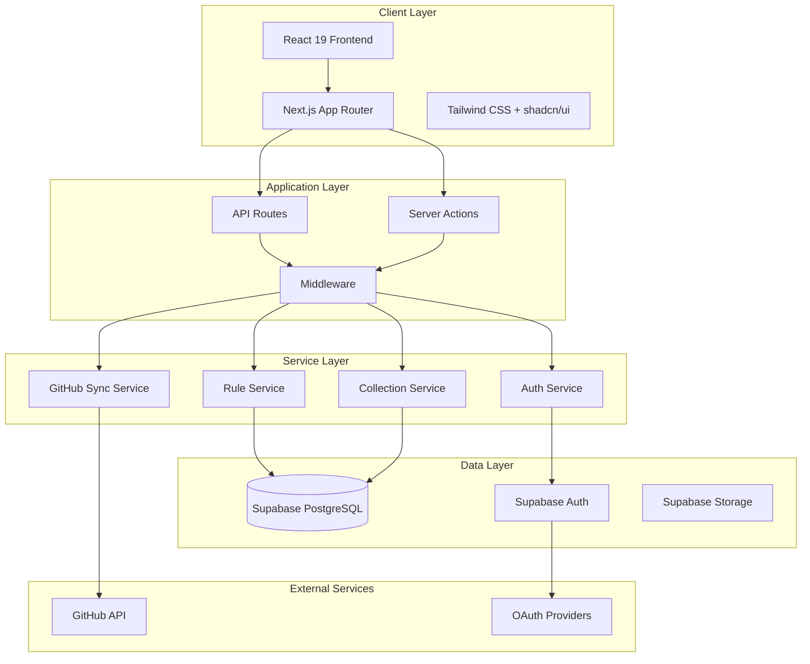
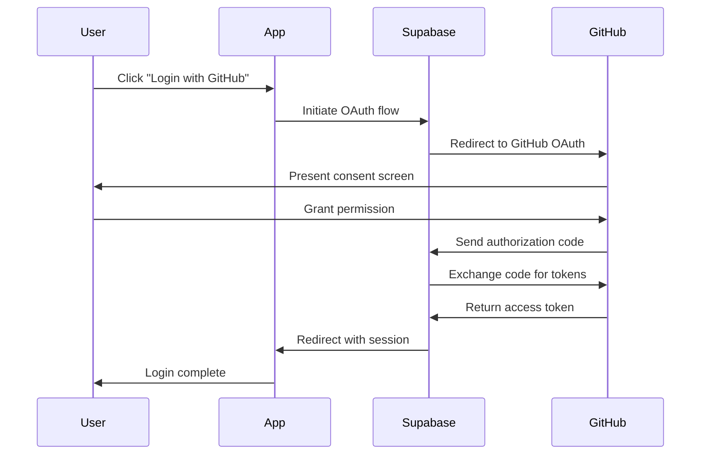

# Documentation.md

# CodePilotRules Hub - Technical Documentation

## Table of Contents
1. [Architecture Overview](#architecture-overview)
2. [Frontend Documentation](#frontend-documentation)
3. [Backend Documentation](#backend-documentation)
4. [Database Schema](#database-schema)
5. [Development Workflows](#development-workflows)
6. [Testing Strategy](#testing-strategy)
7. [Maintenance Guidelines](#maintenance-guidelines)

## Architecture Overview

### System Architecture

The CodePilotRules Hub follows a modern full-stack architecture built on the JAMstack principles with server-side rendering capabilities.



### Design Patterns

#### 1. Service Layer Pattern
All business logic is encapsulated in service modules to maintain separation of concerns:

```typescript
// Example: Rule Service
export class RuleService {
  async getRulesByCategory(category_id: string): Promise<Rule[]> {
    // Business logic implementation
  }
  
  async searchRules(query: string): Promise<SearchResult[]> {
    // Search implementation
  }
}
```

#### 2. Repository Pattern
Data access is abstracted through repository interfaces:

```typescript
interface RuleRepository {
  findById(id: string): Promise<Rule | null>;
  findByCategory(category_id: string): Promise<Rule[]>;
  create(rule: CreateRuleRequest): Promise<Rule>;
  update(id: string, rule: UpdateRuleRequest): Promise<Rule>;
}
```

#### 3. Factory Pattern
For creating configured service instances:

```typescript
export function createGitHubSync(options: SyncOptions): GitHubSync {
  return new GitHubSync(options);
}
```

## Frontend Documentation

### Component Architecture

#### Component Hierarchy
```
App Layout
├── Site Header
│   ├── Main Navigation
│   ├── Global Search
│   ├── Theme Toggle
│   └── User Menu
├── Page Content
│   ├── Breadcrumbs
│   ├── Page Header
│   ├── Content Area
│   └── Sidebar (optional)
└── Site Footer
```

#### Component Categories

1. **Layout Components** (`components/layout/`)
   - `SiteHeader` - Main navigation and user controls
   - `SiteFooter` - Footer with links and information
   - `MainNav` - Primary navigation menu
   - `MobileNav` - Mobile-responsive navigation

2. **UI Components** (`components/ui/`)
   - Atomic design components from shadcn/ui
   - Custom extensions and compositions
   - Consistent styling and behavior

3. **Feature Components** (`components/rules/`, `components/auth/`, etc.)
   - Domain-specific components
   - Complex business logic components
   - Reusable feature patterns

#### State Management

The application uses a hybrid approach to state management:

**1. Server State** - Managed by React Query (planned) or SWR
```typescript
function useRules(category_id?: string) {
  return useSWR(
    category_id ? `/api/rules/${category_id}` : '/api/rules',
    fetcher
  );
}
```

**2. Client State** - React Context for global state
```typescript
const AuthContext = createContext<AuthContextType | undefined>(undefined);

export function AuthProvider({ children }: { children: ReactNode }) {
  const [user, setUser] = useState<User | null>(null);
  // Auth logic...
  
  return (
    <AuthContext.Provider value={{ user, login, logout }}>
      {children}
    </AuthContext.Provider>
  );
}
```

**3. Form State** - React Hook Form for complex forms
```typescript
const form = useForm<SetupFormValues>({
  resolver: zodResolver(setupFormSchema),
  defaultValues: {
    projectName: "",
    aiAssistant: "cursor",
    // ...
  },
});
```

### Routing Structure

The application uses Next.js App Router with the following structure:

```
app/
├── (auth)/                 # Auth route group
│   ├── login/
│   └── register/
├── admin/                  # Admin pages
│   ├── sync/
│   └── users/
├── api/                    # API routes
│   ├── auth/
│   ├── rules/
│   └── admin/
├── collections/            # User collections
│   ├── page.tsx           # List collections
│   ├── new/               # Create collection
│   └── [id]/              # View collection
├── profile/               # User profile
├── rules/                 # Rule browsing
│   ├── page.tsx          # Categories overview
│   ├── [category]/       # Category pages
│   │   ├── page.tsx      # Rule list
│   │   └── [ruleId]/     # Individual rule
│   └── r/                # Rule redirects
│       ├── [ruleId]/     # Direct rule access
│       └── [...path]/    # Path-based access
└── setup/                # Configuration wizard
```

### Performance Optimizations

#### 1. Code Splitting
```typescript
// Dynamic imports for large components
const AdminDashboard = dynamic(() => import('@/components/admin/dashboard'), {
  loading: () => <AdminDashboardSkeleton />,
});
```

#### 2. Image Optimization
```typescript
import Image from 'next/image';

<Image
  src="/avatar.jpg"
  alt="User avatar"
  width={40}
  height={40}
  priority={false}
  placeholder="blur"
/>
```

#### 3. Memoization
```typescript
const MemoizedRuleCard = memo(function RuleCard({ rule }: { rule: Rule }) {
  return (
    <Card>
      <CardHeader>
        <CardTitle>{rule.title}</CardTitle>
      </CardHeader>
    </Card>
  );
});
```

## Backend Documentation

### API Architecture

#### RESTful Design Principles

The API follows RESTful conventions with some GraphQL-inspired features:

```
GET    /api/rules              # List rules with filtering
GET    /api/rules/{id}         # Get specific rule
POST   /api/rules              # Create new rule
PUT    /api/rules/{id}         # Update rule
DELETE /api/rules/{id}         # Delete rule

GET    /api/rules/categories   # List categories
GET    /api/rules/search       # Search rules
```

#### Error Handling Strategy

Standardized error responses across all endpoints:

```typescript
interface ApiError {
  error: string;           // Human-readable error message
  code?: string;          // Machine-readable error code
  details?: any;          // Additional error context
  status: number;         // HTTP status code
}

// Example usage
return NextResponse.json(
  { 
    error: 'Rule not found',
    code: 'RULE_NOT_FOUND',
    details: { ruleId: 'invalid-id' }
  },
  { status: 404 }
);
```

#### Middleware Implementation

```typescript
// Authentication middleware
export async function withAuth(
  request: NextRequest,
  handler: (request: NextRequest, user: User) => Promise<NextResponse>
) {
  const user = await getCurrentUser(request);
  if (!user) {
    return NextResponse.json({ error: 'Unauthorized' }, { status: 401 });
  }
  return handler(request, user);
}

// Usage in API routes
export async function GET(request: NextRequest) {
  return withAuth(request, async (request, user) => {
    // Protected route logic
  });
}
```

### Service Layer Details

#### Rule Service (`lib/services/supabase-rule-service.ts`)

Handles all rule-related operations:

```typescript
export class RuleService {
  // Core CRUD operations
  async getRuleById(id: string): Promise<Rule | null>
  async getRulesByCategory(category_id: string): Promise<PaginatedResult<Rule>>
  async searchRules(query: string): Promise<PaginatedResult<Rule>>
  async createRule(data: CreateRuleRequest): Promise<Rule>
  async updateRule(id: string, data: UpdateRuleRequest): Promise<Rule>
  async deleteRule(id: string): Promise<void>
  
  // Advanced operations
  async incrementDownloads(ruleId: string): Promise<void>
  async getRuleCompatibility(ruleId: string): Promise<Compatibility>
}
```

#### GitHub Sync Service (`lib/services/github/github-sync.ts`)

Manages synchronization with GitHub repositories:

```typescript
export class GitHubSyncService {
  async syncAllRules(): Promise<SyncResult>
  async syncSpecificFiles(files: string[]): Promise<SyncResult>
  async validateRuleFormat(content: string): Promise<ValidationResult>
  async createVersionRecord(ruleId: string, content: string): Promise<void>
}
```

### Authentication Flow

#### OAuth Integration



#### Session Management

```typescript
// Server-side session validation
export async function validateSession(request: NextRequest): Promise<User | null> {
  try {
    const supabase = createServerSupabaseClient();
    const { data: { session } } = await supabase.auth.getSession();
    
    if (!session?.user) {
      return null;
    }
    
    return mapSupabaseUserToAppUser(session.user);
  } catch (error) {
    console.error('Session validation error:', error);
    return null;
  }
}
```

## Database Schema

### Core Tables

#### Rules Table
```sql
CREATE TABLE rules (
  id TEXT PRIMARY KEY,                    -- Unique rule identifier
  title TEXT NOT NULL,                    -- Human-readable title
  slug TEXT NOT NULL UNIQUE,              -- URL-friendly identifier
  description TEXT NOT NULL,              -- Rule description
  content TEXT NOT NULL,                  -- Full rule content (MDC format)
  path TEXT NOT NULL,                     -- File path in repository
  category_id UUID NOT NULL REFERENCES categories(id),
  version TEXT NOT NULL DEFAULT '1.0.0', -- Semantic version
  downloads INTEGER DEFAULT 0,           -- Download counter
  votes INTEGER DEFAULT 0,               -- User votes/likes
  globs TEXT[],                          -- File glob patterns
  tags TEXT[],                           -- Searchable tags
  examples JSONB,                        -- Usage examples
  compatibility JSONB,                   -- Compatibility information
  always_apply BOOLEAN DEFAULT FALSE,    -- Auto-apply flag
  last_updated TIMESTAMP WITH TIME ZONE, -- Content last modified
  created_at TIMESTAMP WITH TIME ZONE DEFAULT NOW(),
  updated_at TIMESTAMP WITH TIME ZONE DEFAULT NOW()
);

-- Indexes for performance
CREATE INDEX idx_rules_category_id ON rules(category_id);
CREATE INDEX idx_rules_tags ON rules USING GIN(tags);
CREATE INDEX idx_rules_search ON rules USING GIN(to_tsvector('english', title || ' ' || description || ' ' || content));
```

#### Categories Table
```sql
CREATE TABLE categories (
  id UUID PRIMARY KEY DEFAULT gen_random_uuid(),
  name TEXT NOT NULL,                     -- Display name
  slug TEXT NOT NULL UNIQUE,              -- URL slug
  description TEXT NOT NULL,              -- Category description
  icon TEXT,                              -- Icon identifier
  parent_id UUID REFERENCES categories(id), -- Hierarchical structure
  order_index INTEGER DEFAULT 0,         -- Display order
  created_at TIMESTAMP WITH TIME ZONE DEFAULT NOW(),
  updated_at TIMESTAMP WITH TIME ZONE DEFAULT NOW()
);

CREATE INDEX idx_categories_parent_id ON categories(parent_id);
CREATE INDEX idx_categories_slug ON categories(slug);
```

#### User Profiles Table
```sql
CREATE TABLE profiles (
  id UUID PRIMARY KEY REFERENCES auth.users(id) ON DELETE CASCADE,
  email TEXT NOT NULL,
  name TEXT,
  github_username TEXT,
  avatar_url TEXT,
  preferred_language TEXT,
  preferred_theme TEXT DEFAULT 'system',
  created_at TIMESTAMP WITH TIME ZONE DEFAULT NOW(),
  updated_at TIMESTAMP WITH TIME ZONE DEFAULT NOW()
);

-- RLS Policies
ALTER TABLE profiles ENABLE ROW LEVEL SECURITY;

CREATE POLICY "Users can view their own profile" ON profiles
  FOR SELECT USING (auth.uid() = id);

CREATE POLICY "Users can update their own profile" ON profiles
  FOR UPDATE USING (auth.uid() = id);
```

### Advanced Features

#### Full-Text Search
```sql
-- Search function for rules
CREATE OR REPLACE FUNCTION search_rules(search_query TEXT, category_slug TEXT DEFAULT NULL, tags TEXT[] DEFAULT NULL)
RETURNS SETOF rules AS $$
BEGIN
  RETURN QUERY
  SELECT r.*
  FROM rules r
  JOIN categories c ON r.category_id = c.id
  WHERE 
    (category_slug IS NULL OR c.slug = category_slug)
    AND (tags IS NULL OR r.tags && tags)
    AND (
      to_tsvector('english', r.title || ' ' || r.description || ' ' || r.content) 
      @@ plainto_tsquery('english', search_query)
    )
  ORDER BY 
    ts_rank(to_tsvector('english', r.title || ' ' || r.description), plainto_tsquery('english', search_query)) DESC,
    r.downloads DESC;
END;
$$ LANGUAGE plpgsql;
```

#### Audit Trail
```sql
CREATE TABLE audit_log (
  id UUID PRIMARY KEY DEFAULT gen_random_uuid(),
  table_name TEXT NOT NULL,
  record_id TEXT NOT NULL,
  action TEXT NOT NULL, -- INSERT, UPDATE, DELETE
  old_values JSONB,
  new_values JSONB,
  user_id UUID REFERENCES auth.users(id),
  created_at TIMESTAMP WITH TIME ZONE DEFAULT NOW()
);

-- Trigger function for audit logging
CREATE OR REPLACE FUNCTION audit_trigger()
RETURNS TRIGGER AS $$
BEGIN
  IF TG_OP = 'DELETE' THEN
    INSERT INTO audit_log (table_name, record_id, action, old_values, user_id)
    VALUES (TG_TABLE_NAME, OLD.id, 'DELETE', row_to_json(OLD), auth.uid());
    RETURN OLD;
  ELSIF TG_OP = 'UPDATE' THEN
    INSERT INTO audit_log (table_name, record_id, action, old_values, new_values, user_id)
    VALUES (TG_TABLE_NAME, NEW.id, 'UPDATE', row_to_json(OLD), row_to_json(NEW), auth.uid());
    RETURN NEW;
  ELSIF TG_OP = 'INSERT' THEN
    INSERT INTO audit_log (table_name, record_id, action, new_values, user_id)
    VALUES (TG_TABLE_NAME, NEW.id, 'INSERT', row_to_json(NEW), auth.uid());
    RETURN NEW;
  END IF;
  RETURN NULL;
END;
$$ LANGUAGE plpgsql;
```

## Development Workflows

### Git Workflow

#### Branch Strategy
```
main                     # Production-ready code
├── develop             # Integration branch
├── feature/rule-search # Feature branches
├── bugfix/auth-issue   # Bug fix branches
└── hotfix/security     # Emergency fixes
```

#### Commit Convention
```bash
# Format: type(scope): description

feat(rules): add advanced search filtering
fix(auth): resolve OAuth callback redirect issue
docs(readme): update installation instructions
style(ui): improve button hover states
refactor(api): extract common error handling
test(rules): add unit tests for rule service
chore(deps): update dependencies to latest versions
```

### CI/CD Pipeline

#### GitHub Actions Workflow
```yaml
name: CI/CD Pipeline
on:
  push:
    branches: [main, develop]
  pull_request:
    branches: [main]

jobs:
  test:
    runs-on: ubuntu-latest
    steps:
      - uses: actions/checkout@v3
      - uses: actions/setup-node@v3
        with:
          node-version: '18'
          cache: 'pnpm'
      
      - run: pnpm install --frozen-lockfile
      - run: pnpm lint
      - run: pnpm type-check
      - run: pnpm test
      - run: pnpm build

  deploy:
    needs: test
    runs-on: ubuntu-latest
    if: github.ref == 'refs/heads/main'
    steps:
      - name: Deploy to Vercel
        uses: amondnet/vercel-action@v20
        with:
          vercel-token: ${{ secrets.VERCEL_TOKEN }}
          vercel-org-id: ${{ secrets.ORG_ID }}
          vercel-project-id: ${{ secrets.PROJECT_ID }}
```

### Code Review Process

#### Review Checklist
- [ ] **Functionality**: Does the code work as intended?
- [ ] **Tests**: Are there appropriate tests for new functionality?
- [ ] **Performance**: Any performance implications?
- [ ] **Security**: Are there any security concerns?
- [ ] **Documentation**: Is the code well-documented?
- [ ] **Style**: Does it follow the project's coding standards?
- [ ] **Breaking Changes**: Any backward compatibility issues?

#### Review Guidelines
1. **Be constructive** - Suggest improvements, don't just point out problems
2. **Be specific** - Reference line numbers and provide examples
3. **Ask questions** - If you don't understand something, ask for clarification
4. **Test thoroughly** - Check out the branch and test locally if needed
5. **Consider alternatives** - Suggest different approaches when appropriate

## Testing Strategy

### Testing Pyramid

```
        /\
       /  \
      /E2E \     <- Few, but comprehensive end-to-end tests
     /______\
    /        \
   /Integration\ <- More integration tests for API and components
  /__________\
 /            \
/    Unit      \ <- Many unit tests for utilities and pure functions
/______________\
```

### Unit Testing

#### Component Testing
```typescript
// Example: RuleCard component test
import { render, screen } from '@testing-library/react';
import { RuleCard } from '@/components/rules/rule-card';

describe('RuleCard', () => {
  const mockRule = {
    id: 'test-rule',
    title: 'Test Rule',
    description: 'A test rule',
    downloads: 100,
    // ... other properties
  };

  it('renders rule information correctly', () => {
    render(<RuleCard rule={mockRule} />);
    
    expect(screen.getByText('Test Rule')).toBeInTheDocument();
    expect(screen.getByText('A test rule')).toBeInTheDocument();
    expect(screen.getByText('100')).toBeInTheDocument();
  });

  it('handles click events', async () => {
    const handleClick = jest.fn();
    render(<RuleCard rule={mockRule} onClick={handleClick} />);
    
    await userEvent.click(screen.getByRole('button'));
    expect(handleClick).toHaveBeenCalledWith(mockRule);
  });
});
```

#### Service Testing
```typescript
// Example: Rule service test
import { RuleService } from '@/lib/services/rule-service';
import { createMockSupabaseClient } from '@/test/mocks/supabase';

describe('RuleService', () => {
  let service: RuleService;
  let mockSupabase: ReturnType<typeof createMockSupabaseClient>;

  beforeEach(() => {
    mockSupabase = createMockSupabaseClient();
    service = new RuleService(mockSupabase);
  });

  describe('getRuleById', () => {
    it('returns rule when found', async () => {
      const mockRule = { id: 'test', title: 'Test Rule' };
      mockSupabase.from.mockReturnValue({
        select: jest.fn().mockReturnThis(),
        eq: jest.fn().mockReturnThis(),
        single: jest.fn().mockResolvedValue({ data: mockRule, error: null })
      });

      const result = await service.getRuleById('test');
      expect(result).toEqual(mockRule);
    });

    it('returns null when not found', async () => {
      mockSupabase.from.mockReturnValue({
        select: jest.fn().mockReturnThis(),
        eq: jest.fn().mockReturnThis(),
        single: jest.fn().mockResolvedValue({ data: null, error: null })
      });

      const result = await service.getRuleById('nonexistent');
      expect(result).toBeNull();
    });
  });
});
```

### Integration Testing

#### API Route Testing
```typescript
// Example: API route integration test
import { createMocks } from 'node-mocks-http';
import handler from '@/app/api/rules/route';

describe('/api/rules', () => {
  it('returns rules list with pagination', async () => {
    const { req, res } = createMocks({
      method: 'GET',
      query: { page: '1', limit: '10' }
    });

    await handler(req, res);

    expect(res._getStatusCode()).toBe(200);
    
    const data = JSON.parse(res._getData());
    expect(data).toHaveProperty('data');
    expect(data).toHaveProperty('pagination');
    expect(data.pagination).toMatchObject({
      page: 1,
      pageSize: 10,
      totalCount: expect.any(Number),
      totalPages: expect.any(Number)
    });
  });
});
```

### End-to-End Testing

#### Playwright Configuration
```typescript
// playwright.config.ts
import { defineConfig } from '@playwright/test';

export default defineConfig({
  testDir: './e2e',
  fullyParallel: true,
  forbidOnly: !!process.env.CI,
  retries: process.env.CI ? 2 : 0,
  workers: process.env.CI ? 1 : undefined,
  reporter: 'html',
  use: {
    baseURL: 'http://localhost:3000',
    trace: 'on-first-retry',
  },
  projects: [
    {
      name: 'chromium',
      use: { ...devices['Desktop Chrome'] },
    },
    {
      name: 'webkit',
      use: { ...devices['Desktop Safari'] },
    },
  ],
  webServer: {
    command: 'pnpm dev',
    port: 3000,
  },
});
```

#### Example E2E Test
```typescript
// e2e/rule-browsing.spec.ts
import { test, expect } from '@playwright/test';

test.describe('Rule Browsing', () => {
  test('user can browse and search rules', async ({ page }) => {
    await page.goto('/');
    
    // Navigate to rules page
    await page.click('text=Browse Rules');
    await expect(page).toHaveURL('/rules');
    
    // Search for a rule
    await page.fill('[placeholder="Search rules..."]', 'typescript');
    await page.press('[placeholder="Search rules..."]', 'Enter');
    
    // Verify search results
    await expect(page.locator('.rule-card')).toHaveCount({ min: 1 });
    await expect(page.locator('text=typescript')).toBeVisible();
  });

  test('user can view rule details', async ({ page }) => {
    await page.goto('/rules/languages');
    
    // Click on first rule
    await page.locator('.rule-card').first().click();
    
    // Verify rule details page
    await expect(page.locator('h1')).toBeVisible();
    await expect(page.locator('.rule-content')).toBeVisible();
    await expect(page.locator('.download-button')).toBeVisible();
  });
});
```

## Maintenance Guidelines

### Dependency Management

#### Regular Updates
```bash
# Check for outdated dependencies
pnpm outdated

# Update dependencies interactively
pnpm update --interactive

# Update major versions carefully
pnpm add @types/node@latest
```

#### Security Auditing
```bash
# Check for security vulnerabilities
pnpm audit

# Fix automatically when possible
pnpm audit --fix

# Generate security report
pnpm audit --json > security-audit.json
```

### Performance Monitoring

#### Core Web Vitals Tracking
```typescript
// lib/analytics.ts
export function trackWebVitals(metric: Metric) {
  switch (metric.name) {
    case 'FCP': // First Contentful Paint
    case 'LCP': // Largest Contentful Paint
    case 'FID': // First Input Delay
    case 'CLS': // Cumulative Layout Shift
      console.log(metric.name, metric.value);
      // Send to analytics service
      break;
  }
}

// app/layout.tsx
import { trackWebVitals } from '@/lib/analytics';

export function reportWebVitals(metric: Metric) {
  trackWebVitals(metric);
}
```

#### Database Performance
```sql
-- Monitor slow queries
SELECT 
  query,
  calls,
  total_time,
  mean_time,
  stddev_time
FROM pg_stat_statements
WHERE mean_time > 100
ORDER BY mean_time DESC
LIMIT 10;

-- Check index usage
SELECT 
  schemaname,
  tablename,
  indexname,
  idx_scan,
  idx_tup_read,
  idx_tup_fetch
FROM pg_stat_user_indexes
WHERE idx_scan = 0
ORDER BY relname;
```

### Backup and Recovery

#### Database Backup Strategy
1. **Automated Backups**: Supabase handles daily backups automatically
2. **Point-in-Time Recovery**: Available for Pro plans
3. **Manual Backups**: For critical updates

```bash
# Manual backup using Supabase CLI
supabase db dump --local > backup-$(date +%Y%m%d).sql

# Restore from backup
supabase db reset --local
psql -h localhost -p 54322 -U postgres -d postgres < backup-20240101.sql
```

#### Disaster Recovery Plan
1. **Database Failure**: Restore from Supabase backup
2. **Code Repository**: GitHub maintains full history
3. **Deployment Platform**: Vercel automatic rollbacks
4. **Environment Variables**: Stored securely in deployment platform

### Monitoring and Alerting

#### Application Monitoring
```typescript
// lib/monitoring.ts
export class ApplicationMonitor {
  static logError(error: Error, context: string) {
    console.error(`[${context}] ${error.message}`, {
      stack: error.stack,
      timestamp: new Date().toISOString(),
      context
    });
    
    // Send to monitoring service (Sentry, LogRocket, etc.)
  }
  
  static trackPerformance(metric: string, value: number) {
    console.log(`Performance: ${metric} = ${value}ms`);
    // Send to analytics service
  }
}
```

#### Health Check Endpoint
```typescript
// app/api/health/route.ts
export async function GET() {
  try {
    const supabase = createServerSupabaseClient();
    
    // Test database connection
    const { data, error } = await supabase
      .from('rules')
      .select('count')
      .limit(1);
    
    if (error) throw error;
    
    return NextResponse.json({
      status: 'healthy',
      timestamp: new Date().toISOString(),
      database: 'connected',
      uptime: process.uptime()
    });
  } catch (error) {
    return NextResponse.json({
      status: 'unhealthy',
      error: error.message
    }, { status: 503 });
  }
}
```

### Security Best Practices

#### Regular Security Reviews
1. **Dependency Scanning**: Weekly automated scans
2. **Code Security**: Static analysis with ESLint security rules
3. **Environment Security**: Regular access review
4. **Data Protection**: Audit data access patterns

#### Security Checklist
- [ ] All environment variables properly secured
- [ ] Supabase RLS policies correctly configured
- [ ] Admin endpoints protected with proper authorization
- [ ] Input validation on all API endpoints
- [ ] HTTPS enforced in production
- [ ] Regular dependency updates
- [ ] Audit logs reviewed monthly

### Release Management

#### Versioning Strategy
Using semantic versioning (semver):
- **MAJOR**: Breaking changes
- **MINOR**: New features, backward compatible
- **PATCH**: Bug fixes, backward compatible

#### Release Process
1. **Feature Development**: Work in feature branches
2. **Code Review**: All changes require PR approval
3. **Testing**: Automated tests must pass
4. **Staging Deployment**: Deploy to staging for testing
5. **Production Release**: Deploy to production after approval
6. **Monitoring**: Monitor for issues post-deployment
7. **Rollback Plan**: Ready to rollback if issues arise

#### Release Notes Template
```markdown
## Version 1.2.0 - 2024-01-15

### 🚀 New Features
- Added advanced rule search with filters
- Implemented user collections functionality
- Enhanced setup wizard with more options

### 🐛 Bug Fixes
- Fixed authentication redirect issues
- Resolved mobile navigation problems
- Corrected rule sorting in category pages

### 🔧 Improvements
- Improved page load performance by 25%
- Enhanced accessibility with better keyboard navigation
- Updated UI components to latest design system

### 📖 Documentation
- Updated API documentation
- Added troubleshooting guide
- Improved installation instructions

### 🔄 Dependencies
- Updated Next.js to 15.0.2
- Updated Supabase client to 2.38.0
- Updated various security dependencies
```

This comprehensive documentation serves as a complete guide for developers working on the CodePilotRules Hub project, covering all aspects from architecture to maintenance procedures.